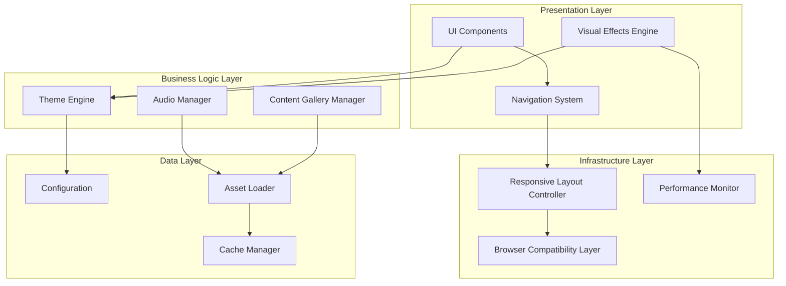
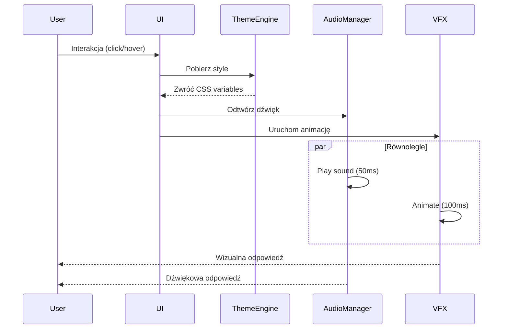

# Dokument Projektowy: Anime-Cyberpunk Portfolio

## Overview

Anime-Cyberpunk Portfolio to jednostronicowa aplikacja webowa (SPA) łącząca estetykę anime z cyberpunkową stylistyką neonową. Projekt wykorzystuje nowoczesne technologie webowe do stworzenia immersyjnego, interaktywnego doświadczenia z dynamicznymi efektami wizualnymi, dźwiękami i responsywnym designem.

### Kluczowe Decyzje Projektowe

1. **Architektura**: Modułowa architektura oparta na komponentach z wyraźnym rozdzieleniem odpowiedzialności
2. **Technologie**: HTML5, CSS3 (z CSS Custom Properties dla motywu), Vanilla JavaScript lub lekki framework (np. Alpine.js)
3. **Efekty wizualne**: CSS animations + Canvas API dla zaawansowanych efektów cząsteczkowych
4. **Audio**: Web Audio API dla precyzyjnej kontroli i synchronizacji dźwięku
5. **Responsywność**: Mobile-first approach z progressive enhancement dla desktop
6. **Wydajność**: Lazy loading, code splitting, optymalizacja zasobów

### Inspiracje Wizualne

Projekt czerpie inspirację z następujących serii:
- **Darling in the Franxx**: Paleta kolorów (różowy, czerwony, niebieski)
- **Death Note**: Ciemne tło, kontrastowe elementy
- **Tokyo Ghoul**: Mroczna atmosfera z neonowymi akcentami
- **Castlevania/Devil May Cry**: Gotyckie elementy z nowoczesnym twistem
- **Rick and Morty**: Żywe kolory neonowe, sci-fi elementy

## Architecture

### Architektura Wysokiego Poziomu



### Wzorce Projektowe

1. **Module Pattern**: Enkapsulacja funkcjonalności w niezależne moduły
2. **Observer Pattern**: Synchronizacja audio-wizualna, event handling
3. **Singleton Pattern**: Theme Engine, Audio Manager (jedna instancja)
4. **Factory Pattern**: Tworzenie efektów wizualnych, komponentów UI
5. **Strategy Pattern**: Różne strategie renderowania dla mobile/desktop
6. **Lazy Loading Pattern**: Ładowanie zasobów na żądanie

### Przepływ Danych



## Components and Interfaces

### 1. Theme Engine

**Odpowiedzialność**: Zarządzanie motywem wizualnym, kolorami, typografią

**Interface**:
```typescript
interface ThemeEngine {
  // Inicjalizacja motywu
  initialize(): void;
  
  // Pobierz wartość zmiennej CSS
  getCSSVariable(name: string): string;
  
  // Ustaw wartość zmiennej CSS
  setCSSVariable(name: string, value: string): void;
  
  // Pobierz paletę kolorów
  getColorPalette(): ColorPalette;
  
  // Zastosuj motyw do elementu
  applyTheme(element: HTMLElement): void;
}

interface ColorPalette {
  primary: string;      // Electric blue (#00f3ff)
  secondary: string;    // Hot pink (#ff006e)
  accent: string;       // Purple (#8b00ff)
  background: string;   // Dark (#0a0a0f)
  text: string;         // Light (#e0e0e0)
  neonGlow: string;     // Cyan (#00ffff)
}
```

**Implementacja**:
- CSS Custom Properties dla dynamicznego motywu
- Predefiniowane palety kolorów inspirowane anime
- Funkcje pomocnicze do generowania efektów neonowych

### 2. Visual Effects Engine

**Odpowiedzialność**: Renderowanie efektów wizualnych, animacji, cząsteczek

**Interface**:
```typescript
interface VisualEffectsEngine {
  // Inicjalizacja silnika
  initialize(canvas: HTMLCanvasElement): void;
  
  // Uruchom efekt neonowego świecenia
  applyNeonGlow(element: HTMLElement, intensity: number): void;
  
  // Uruchom animację parallax
  enableParallax(elements: HTMLElement[], speed: number): void;
  
  // Renderuj efekt cząsteczkowy
  renderParticles(config: ParticleConfig): void;
  
  // Animuj pojawienie się elementu
  fadeIn(element: HTMLElement, delay: number): Promise<void>;
  
  // Zatrzymaj wszystkie efekty
  stopAll(): void;
  
  // Pobierz aktualny FPS
  getFPS(): number;
}

interface ParticleConfig {
  count: number;
  color: string;
  size: number;
  speed: number;
  lifetime: number;
}
```

**Implementacja**:
- Canvas API dla efektów cząsteczkowych
- CSS animations dla prostych przejść
- RequestAnimationFrame dla płynnych animacji
- Performance monitoring (FPS counter)

### 3. Audio Manager

**Odpowiedzialność**: Zarządzanie dźwiękami, synchronizacja z wizualizacjami

**Interface**:
```typescript
interface AudioManager {
  // Inicjalizacja z preloadingiem
  initialize(audioFiles: AudioFile[]): Promise<void>;
  
  // Odtwórz efekt dźwiękowy
  playSound(soundId: string, volume?: number): void;
  
  // Odtwórz muzykę w tle
  playBackgroundMusic(trackId: string, loop: boolean): void;
  
  // Zatrzymaj muzykę
  stopBackgroundMusic(): void;
  
  // Ustaw globalną głośność
  setVolume(volume: number): void;
  
  // Wycisz/włącz dźwięk
  mute(muted: boolean): void;
  
  // Sprawdź czy audio jest gotowe
  isReady(): boolean;
}

interface AudioFile {
  id: string;
  url: string;
  type: 'effect' | 'music';
  preload: boolean;
}
```

**Implementacja**:
- Web Audio API dla precyzyjnej kontroli
- Audio sprite dla efektów dźwiękowych (optymalizacja)
- Preloading z progress indicator
- Fallback dla przeglądarek bez wsparcia

### 4. Responsive Layout Controller

**Odpowiedzialność**: Adaptacja layoutu do różnych urządzeń

**Interface**:
```typescript
interface ResponsiveLayoutController {
  // Inicjalizacja z breakpointami
  initialize(breakpoints: Breakpoints): void;
  
  // Pobierz aktualny typ urządzenia
  getDeviceType(): 'mobile' | 'tablet' | 'desktop';
  
  // Zarejestruj callback na zmianę rozmiaru
  onResize(callback: (deviceType: string) => void): void;
  
  // Zastosuj layout dla urządzenia
  applyLayout(deviceType: string): void;
  
  // Sprawdź czy touch device
  isTouchDevice(): boolean;
}

interface Breakpoints {
  mobile: number;    // 0-767px
  tablet: number;    // 768-1023px
  desktop: number;   // 1024px+
}
```

**Implementacja**:
- CSS Media Queries
- JavaScript Resize Observer API
- Mobile-first CSS approach
- Touch detection dla optymalizacji interakcji

### 5. Navigation System

**Odpowiedzialność**: Nawigacja między sekcjami, smooth scrolling

**Interface**:
```typescript
interface NavigationSystem {
  // Inicjalizacja nawigacji
  initialize(sections: Section[]): void;
  
  // Przejdź do sekcji
  navigateTo(sectionId: string, smooth: boolean): void;
  
  // Pobierz aktualną sekcję
  getCurrentSection(): string;
  
  // Zarejestruj callback na zmianę sekcji
  onSectionChange(callback: (sectionId: string) => void): void;
  
  // Pokaż/ukryj menu mobilne
  toggleMobileMenu(show: boolean): void;
}

interface Section {
  id: string;
  title: string;
  element: HTMLElement;
}
```

**Implementacja**:
- Intersection Observer API dla detekcji aktywnej sekcji
- Smooth scroll behavior
- Hamburger menu dla mobile
- Sticky/fixed navigation dla desktop

### 6. Content Gallery Manager

**Odpowiedzialność**: Zarządzanie galerią zdjęć i mediów

**Interface**:
```typescript
interface ContentGalleryManager {
  // Inicjalizacja galerii
  initialize(items: GalleryItem[]): void;
  
  // Załaduj obrazy (lazy loading)
  loadImages(viewport: HTMLElement): void;
  
  // Otwórz lightbox
  openLightbox(itemId: string): void;
  
  // Zamknij lightbox
  closeLightbox(): void;
  
  // Filtruj według kategorii
  filterByCategory(category: string): void;
  
  // Pobierz wszystkie kategorie
  getCategories(): string[];
}

interface GalleryItem {
  id: string;
  title: string;
  description: string;
  imageUrl: string;
  thumbnailUrl: string;
  category: string;
  alt: string;
}
```

**Implementacja**:
- Intersection Observer dla lazy loading
- Lightbox z keyboard navigation
- WebP z JPEG fallback
- Responsive images (srcset)

### 7. Performance Monitor

**Odpowiedzialność**: Monitorowanie wydajności, optymalizacja

**Interface**:
```typescript
interface PerformanceMonitor {
  // Rozpocznij monitorowanie
  start(): void;
  
  // Pobierz metryki wydajności
  getMetrics(): PerformanceMetrics;
  
  // Sprawdź czy wydajność jest akceptowalna
  isPerformanceAcceptable(): boolean;
  
  // Dostosuj jakość efektów do wydajności
  adjustQuality(level: 'low' | 'medium' | 'high'): void;
}

interface PerformanceMetrics {
  fps: number;
  loadTime: number;
  memoryUsage: number;
  lighthouseScore?: number;
}
```

**Implementacja**:
- Performance API
- FPS counter (RequestAnimationFrame)
- Adaptive quality (redukcja efektów przy niskiej wydajności)
- Lighthouse CI integration

## Data Models

### Configuration Model

```typescript
interface PortfolioConfig {
  // Informacje o właścicielu
  owner: {
    name: string;
    email: string;
    social: SocialLinks;
  };
  
  // Konfiguracja motywu
  theme: {
    colorPalette: ColorPalette;
    fonts: FontConfig;
    animations: AnimationConfig;
  };
  
  // Konfiguracja audio
  audio: {
    enabled: boolean;
    defaultVolume: number;
    sounds: AudioFile[];
  };
  
  // Sekcje strony
  sections: Section[];
  
  // Elementy galerii
  gallery: GalleryItem[];
  
  // Informacje prawne
  legal: {
    copyrightYear: number;
    termsUrl: string;
    privacyUrl: string;
    attributions: Attribution[];
  };
}

interface SocialLinks {
  github?: string;
  linkedin?: string;
  twitter?: string;
  email?: string;
}

interface FontConfig {
  heading: string;  // np. 'Orbitron', 'Rajdhani'
  body: string;     // np. 'Inter', 'Roboto'
}

interface AnimationConfig {
  duration: {
    fast: number;    // 200ms
    normal: number;  // 500ms
    slow: number;    // 800ms
  };
  easing: string;    // 'cubic-bezier(0.4, 0, 0.2, 1)'
}

interface Attribution {
  type: 'font' | 'icon' | 'image' | 'audio' | 'library';
  name: string;
  author: string;
  license: string;
  url: string;
}
```

### State Model

```typescript
interface ApplicationState {
  // Stan UI
  ui: {
    currentSection: string;
    mobileMenuOpen: boolean;
    lightboxOpen: boolean;
    currentLightboxItem: string | null;
  };
  
  // Stan audio
  audio: {
    initialized: boolean;
    muted: boolean;
    volume: number;
    currentTrack: string | null;
  };
  
  // Stan wydajności
  performance: {
    fps: number;
    qualityLevel: 'low' | 'medium' | 'high';
    effectsEnabled: boolean;
  };
  
  // Stan urządzenia
  device: {
    type: 'mobile' | 'tablet' | 'desktop';
    isTouch: boolean;
    screenWidth: number;
    screenHeight: number;
  };
  
  // Preferencje użytkownika
  preferences: {
    audioEnabled: boolean;
    reducedMotion: boolean;
    cookieConsent: boolean;
  };
}
```

### Event Model

```typescript
interface PortfolioEvent {
  type: EventType;
  timestamp: number;
  data: any;
}

type EventType =
  | 'section:change'
  | 'navigation:click'
  | 'gallery:open'
  | 'gallery:close'
  | 'audio:play'
  | 'audio:stop'
  | 'theme:change'
  | 'resize:window'
  | 'performance:warning';
```


## Correctness Properties

*Właściwość (property) to cecha lub zachowanie, które powinno być prawdziwe dla wszystkich prawidłowych wykonań systemu - zasadniczo formalne stwierdzenie tego, co system powinien robić. Właściwości służą jako pomost między czytelnymi dla człowieka specyfikacjami a weryfikowalnymi maszynowo gwarancjami poprawności.*

### Property 1: Spójność wartości CSS w motywie

*Dla wszystkich* komponentów UI, wartości CSS variables dla motywu (kolory, blur radius 10-30px, transition duration 200-500ms) powinny być spójne i pochodzić z Theme Engine.

**Validates: Requirements 1.4, 1.5, 2.5**

### Property 2: Responsywność interakcji wizualno-dźwiękowych

*Dla wszystkich* interaktywnych elementów, reakcja wizualna (neon glow) powinna nastąpić w ciągu 100ms od interakcji, a dźwięk w ciągu 50ms.

**Validates: Requirements 2.1, 3.1**

### Property 3: Synchronizacja audio-wizualna

*Dla wszystkich* par efekt dźwiękowy-animacja wizualna, oba powinny startować w tym samym czasie (z tolerancją ±20ms).

**Validates: Requirements 3.3**

### Property 4: Brak poziomego scrollowania na mobile

*Dla wszystkich* elementów DOM na urządzeniu mobilnym (viewport < 768px), szerokość elementu nie powinna przekraczać szerokości viewport.

**Validates: Requirements 4.1**

### Property 5: Minimalne rozmiary dla dostępności na mobile

*Dla wszystkich* elementów tekstowych na mobile, font-size powinien być >= 14px, a dla wszystkich interaktywnych elementów, touch target powinien być >= 44px.

**Validates: Requirements 4.2, 4.4**

### Property 6: Wydajność animacji zależna od urządzenia

*Dla wszystkich* animacji, frame rate powinien być > 30fps na mobile i > 60fps na desktop podczas aktywnych animacji.

**Validates: Requirements 4.6, 8.3**

### Property 7: Zachowanie aspect ratio obrazów

*Dla wszystkich* obrazów i mediów, aspect ratio powinien pozostać niezmieniony niezależnie od rozdzielczości ekranu i rozmiaru viewport.

**Validates: Requirements 5.4**

### Property 8: Lightbox dla wszystkich obrazów galerii

*Dla wszystkich* obrazów w Content_Gallery, kliknięcie powinno otworzyć pełnoekranowy widok lightbox.

**Validates: Requirements 6.3**

### Property 9: Metadane dla obrazów galerii

*Dla wszystkich* obrazów w galerii, powinny być dostępne caption i description (mogą być puste, ale pola muszą istnieć).

**Validates: Requirements 6.4**

### Property 10: Czas scrollowania do sekcji

*Dla wszystkich* linków nawigacyjnych, kliknięcie powinno spowodować płynne przewinięcie do docelowej sekcji w czasie <= 800ms.

**Validates: Requirements 7.2**

### Property 11: Podświetlenie aktywnej sekcji

*Dla wszystkich* sekcji strony, gdy sekcja jest widoczna w viewport (>50% wysokości), odpowiadający jej link w nawigacji powinien być podświetlony.

**Validates: Requirements 7.3**

### Property 12: Wizualny feedback dla nawigacji

*Dla wszystkich* elementów nawigacyjnych, stany hover i active powinny mieć zastosowane style neonowego efektu (glow).

**Validates: Requirements 7.5**

### Property 13: Alternatywny tekst dla obrazów

*Dla wszystkich* elementów `` i `<picture>`, atrybut `alt` musi być obecny (może być pusty dla obrazów dekoracyjnych, ale musi istnieć).

**Validates: Requirements 9.1**

### Property 14: Kontrast kolorów dla dostępności

*Dla wszystkich* par tekst-tło w systemie, współczynnik kontrastu powinien być >= 4.5:1 (WCAG AA standard).

**Validates: Requirements 9.2**

### Property 15: Dostępność klawiaturowa

*Dla wszystkich* interaktywnych elementów (linki, przyciski, kontrolki), powinny być dostępne przez nawigację klawiaturą (Tab/Shift+Tab) i mieć widoczny focus indicator.

**Validates: Requirements 9.3**

### Property 16: Wizualne wskaźniki dla audio

*Dla wszystkich* zdarzeń odtwarzania dźwięku, powinien istnieć odpowiadający wizualny wskaźnik (animacja, zmiana koloru, ikona).

**Validates: Requirements 9.5**

### Property 17: Semantyczny HTML

*Dla wszystkich* głównych sekcji strony, powinny być użyte semantyczne elementy HTML5 (`<nav>`, `<main>`, `<article>`, `<section>`, `<footer>`) zamiast generycznych `<div>`.

**Validates: Requirements 9.6**

### Property 18: Graceful degradation dla nieobsługiwanych funkcji

*Dla wszystkich* nowoczesnych funkcji przeglądarki (Web Audio API, Canvas API, Intersection Observer), powinien istnieć fallback lub polyfill dla starszych przeglądarek.

**Validates: Requirements 10.5**

### Property 19: Atrybucja dla zasobów zewnętrznych

*Dla wszystkich* zasobów zewnętrznych (fonty, ikony, obrazy, audio, biblioteki), powinna istnieć odpowiadająca atrybucja w konfiguracji z informacją o autorze, licencji i źródle.

**Validates: Requirements 11.3, 11.7**


## Error Handling

### Strategia Obsługi Błędów

System implementuje wielowarstwową strategię obsługi błędów:

1. **Walidacja wejścia**: Wszystkie dane wejściowe są walidowane przed przetworzeniem
2. **Graceful degradation**: Brak krytycznych funkcji nie blokuje podstawowej funkcjonalności
3. **User feedback**: Błędy są komunikowane użytkownikowi w przyjazny sposób
4. **Logging**: Błędy są logowane dla celów debugowania (tylko w dev mode)
5. **Recovery**: System próbuje odzyskać się z błędów automatycznie gdzie to możliwe

### Kategorie Błędów

#### 1. Błędy Ładowania Zasobów

**Scenariusz**: Obrazy, audio, fonty nie mogą być załadowane

**Obsługa**:
- Obrazy: Wyświetl placeholder z ikoną błędu
- Audio: Wyłącz Audio Manager, pokaż komunikat (opcjonalnie)
- Fonty: Użyj system font fallback

```typescript
// Przykład obsługi błędu ładowania obrazu
function handleImageError(img: HTMLImageElement): void {
  img.src = '/assets/placeholder-error.svg';
  img.alt = 'Nie udało się załadować obrazu';
  console.warn(`Failed to load image: ${img.dataset.originalSrc}`);
}
```

#### 2. Błędy Audio API

**Scenariusz**: Przeglądarka nie obsługuje Web Audio API lub użytkownik zablokował autoplay

**Obsługa**:
- Wykryj brak wsparcia przy inicjalizacji
- Wyłącz funkcje audio
- Pokaż komunikat z opcją włączenia audio po interakcji użytkownika
- Zachowaj wszystkie wizualne funkcje

```typescript
function initializeAudio(): boolean {
  try {
    const audioContext = new (window.AudioContext || window.webkitAudioContext)();
    return true;
  } catch (error) {
    console.warn('Web Audio API not supported', error);
    disableAudioFeatures();
    return false;
  }
}
```

#### 3. Błędy Wydajności

**Scenariusz**: FPS spada poniżej akceptowalnego poziomu

**Obsługa**:
- Performance Monitor wykrywa niski FPS
- Automatycznie redukuj jakość efektów
- Wyłącz efekty cząsteczkowe
- Ogranicz liczbę równoczesnych animacji

```typescript
function adjustPerformance(fps: number): void {
  if (fps < 30) {
    visualEffects.setQuality('low');
    visualEffects.disableParticles();
  } else if (fps < 50) {
    visualEffects.setQuality('medium');
  }
}
```

#### 4. Błędy Nawigacji

**Scenariusz**: Sekcja docelowa nie istnieje

**Obsługa**:
- Sprawdź czy element istnieje przed scrollowaniem
- Jeśli nie istnieje, scrolluj do góry strony
- Zaloguj ostrzeżenie

```typescript
function navigateToSection(sectionId: string): void {
  const section = document.getElementById(sectionId);
  if (!section) {
    console.warn(`Section not found: ${sectionId}`);
    window.scrollTo({ top: 0, behavior: 'smooth' });
    return;
  }
  section.scrollIntoView({ behavior: 'smooth' });
}
```

#### 5. Błędy Kompatybilności Przeglądarki

**Scenariusz**: Przeglądarka nie obsługuje wymaganej funkcji

**Obsługa**:
- Feature detection przy inicjalizacji
- Załaduj polyfills dla brakujących funkcji
- Użyj fallback implementacji
- W ostateczności wyświetl komunikat o nieobsługiwanej przeglądarce


```typescript
// Feature detection
const features = {
  intersectionObserver: 'IntersectionObserver' in window,
  webAudio: 'AudioContext' in window || 'webkitAudioContext' in window,
  canvas: !!document.createElement('canvas').getContext,
  webp: checkWebPSupport()
};

function initializeWithFallbacks(): void {
  if (!features.intersectionObserver) {
    loadPolyfill('intersection-observer');
  }
  if (!features.webAudio) {
    disableAudioFeatures();
  }
  // ... inne fallbacki
}
```

### Obsługa Błędów Użytkownika

#### Nieprawidłowe Interakcje

- Kliknięcie podczas animacji: Ignoruj lub kolejkuj
- Szybkie wielokrotne kliknięcia: Debouncing
- Próba otwarcia lightbox gdy już otwarty: Ignoruj

#### Problemy z Siecią

- Timeout dla ładowania zasobów: 10 sekund
- Retry logic dla krytycznych zasobów: 3 próby
- Offline mode: Wyświetl komunikat, zachowaj podstawową funkcjonalność

## Testing Strategy

### Podejście do Testowania

System wykorzystuje **podwójne podejście testowe** łączące testy jednostkowe i testy oparte na właściwościach (property-based testing):

- **Testy jednostkowe**: Weryfikują konkretne przykłady, przypadki brzegowe i warunki błędów
- **Testy właściwości**: Weryfikują uniwersalne właściwości dla wszystkich możliwych wejść
- Oba podejścia są komplementarne i niezbędne dla kompleksowego pokrycia

### Biblioteki Testowe

**Framework testowy**: Vitest (szybki, kompatybilny z Vite)
**Property-based testing**: fast-check (dla JavaScript/TypeScript)
**Testing utilities**: @testing-library/dom (dla testów DOM)
**E2E testing**: Playwright (dla testów cross-browser)

### Konfiguracja Property-Based Testing

Każdy test właściwości:
- Wykonuje minimum **100 iteracji** (ze względu na randomizację)
- Jest otagowany komentarzem referencyjnym do właściwości z design doc
- Format tagu: `// Feature: anime-cyberpunk-portfolio, Property {number}: {property_text}`

Przykład:
```typescript
// Feature: anime-cyberpunk-portfolio, Property 1: Spójność wartości CSS w motywie
test('all components use consistent CSS variables from Theme Engine', () => {
  fc.assert(
    fc.property(fc.array(fc.webComponent()), (components) => {
      const themeEngine = new ThemeEngine();
      components.forEach(comp => {
        const blurRadius = getComputedStyle(comp).getPropertyValue('--neon-blur');
        expect(parseInt(blurRadius)).toBeGreaterThanOrEqual(10);
        expect(parseInt(blurRadius)).toBeLessThanOrEqual(30);
      });
    }),
    { numRuns: 100 }
  );
});
```

### Strategia Testów Jednostkowych

Testy jednostkowe skupiają się na:
1. **Konkretnych przykładach** demonstrujących poprawne zachowanie
2. **Przypadkach brzegowych** (puste dane, maksymalne wartości, null/undefined)
3. **Warunkach błędów** (błędy sieci, brak wsparcia przeglądarki)
4. **Punktach integracji** między komponentami

**Balans testów jednostkowych**:
- Unikaj pisania zbyt wielu testów jednostkowych
- Property-based testy pokrywają wiele przypadków wejściowych
- Testy jednostkowe dla konkretnych scenariuszy i edge cases


### Plan Testów według Komponentów

#### Theme Engine

**Property Tests**:
- Property 1: Spójność CSS variables (100 iteracji z losowymi komponentami)

**Unit Tests**:
- Inicjalizacja z domyślną paletą kolorów (Req 1.1)
- Zastosowanie anime-style typography (Req 1.3)
- getCSSVariable zwraca poprawne wartości
- setCSSVariable aktualizuje wartości

#### Visual Effects Engine

**Property Tests**:
- Property 2: Responsywność interakcji < 100ms (losowe elementy)
- Property 6: FPS > 30 mobile, > 60 desktop (losowe animacje)

**Unit Tests**:
- Parallax scrolling dla elementów tła (Req 2.2)
- Staggered fade-in przy ładowaniu strony (Req 2.3)
- Renderowanie efektu cząsteczkowego (Req 2.4)
- Obsługa błędów gdy Canvas nie jest dostępny

#### Audio Manager

**Property Tests**:
- Property 2: Odtwarzanie dźwięku < 50ms (losowe elementy)
- Property 3: Synchronizacja audio-wizualna ±20ms (losowe pary)
- Property 16: Wizualne wskaźniki dla każdego dźwięku

**Unit Tests**:
- Preloading audio files (Req 3.4)
- Background music z kontrolą głośności (Req 3.2)
- Mute/unmute functionality (Req 3.5)
- Obsługa formatów MP3 i OGG (Req 3.6)
- Graceful degradation gdy Web Audio API niedostępne

#### Responsive Layout Controller

**Property Tests**:
- Property 4: Brak horizontal scroll na mobile (losowe elementy)
- Property 5: Font size >= 14px, touch targets >= 44px na mobile
- Property 7: Zachowanie aspect ratio (losowe obrazy, rozdzielczości)

**Unit Tests**:
- Detekcja typu urządzenia (mobile/tablet/desktop)
- Transformacja nawigacji do hamburger menu na mobile (Req 4.3)
- Media queries w CSS (Req 4.5)
- Max width 1920px z centrowaniem na desktop (Req 5.1)
- Enhanced effects na desktop (Req 5.2)
- Full navigation menu na desktop (Req 5.3)
- Multi-column layout na desktop (Req 5.5)

#### Navigation System

**Property Tests**:
- Property 10: Scroll time <= 800ms (losowe sekcje)
- Property 11: Podświetlenie aktywnej sekcji (wszystkie sekcje)
- Property 12: Neon effect na hover/active (wszystkie linki)

**Unit Tests**:
- Nawigacja do wszystkich głównych sekcji (Req 7.1)
- Sticky positioning na desktop (Req 7.4)
- Obsługa nieistniejącej sekcji (error handling)

#### Content Gallery Manager

**Property Tests**:
- Property 8: Lightbox dla wszystkich obrazów (losowe obrazy)
- Property 9: Caption i description dla wszystkich obrazów

**Unit Tests**:
- WebP z JPEG fallback (Req 6.1)
- Lazy loading implementacja (Req 6.2)
- Filtrowanie po kategoriach (Req 6.5)
- Optymalizacja rozmiaru plików (Req 6.6)

#### Accessibility

**Property Tests**:
- Property 13: Alt text dla wszystkich obrazów (losowe obrazy)
- Property 14: Contrast ratio >= 4.5:1 (wszystkie pary tekst-tło)
- Property 15: Keyboard navigation (wszystkie interaktywne elementy)
- Property 17: Semantyczny HTML (wszystkie sekcje)

**Unit Tests**:
- Skip navigation links (Req 9.4)

#### Performance & Optimization

**Unit Tests**:
- Initial load time < 3s (Req 8.1)
- Lighthouse score > 80 (Req 8.2)
- Code splitting implementacja (Req 8.4)
- Minifikacja CSS/JS (Req 8.5)
- Cache headers dla static assets (Req 8.6)

#### Browser Compatibility

**Property Tests**:
- Property 18: Fallbacks dla wszystkich nowoczesnych funkcji

**Unit Tests**:
- Funkcjonalność w Chrome 90+ (Req 10.1)
- Funkcjonalność w Firefox 88+ (Req 10.2)
- Funkcjonalność w Safari 14+ (Req 10.3)
- Funkcjonalność w Edge 90+ (Req 10.4)

#### Legal & Copyright

**Property Tests**:
- Property 19: Atrybucja dla wszystkich external assets

**Unit Tests**:
- Copyright notice w footer (Req 11.1)
- Terms of use i privacy policy (Req 11.2)
- GDPR cookie consent (Req 11.4)
- Informacje kontaktowe (Req 11.5)
- IP disclaimer (Req 11.6)

### Testy E2E (End-to-End)

Playwright dla testów cross-browser:

1. **User Journey: Przeglądanie portfolio**
   - Załaduj stronę
   - Nawiguj przez wszystkie sekcje
   - Otwórz galerię i lightbox
   - Sprawdź responsywność (mobile/desktop viewports)

2. **User Journey: Interakcje audio-wizualne**
   - Włącz audio
   - Kliknij różne elementy
   - Sprawdź synchronizację dźwięku i animacji

3. **User Journey: Accessibility**
   - Nawigacja tylko klawiaturą
   - Test z screen readerem (axe-core)
   - Sprawdź kontrast kolorów

### Continuous Integration

- Testy uruchamiane przy każdym commit (GitHub Actions / GitLab CI)
- Property tests z seedem dla reprodukowalności
- Coverage target: 80% dla kodu logiki biznesowej
- Lighthouse CI dla monitorowania wydajności
- Cross-browser testing w pipeline

### Metryki Sukcesu

- Wszystkie property tests przechodzą (100 iteracji każdy)
- Coverage >= 80%
- Lighthouse Performance >= 80
- Lighthouse Accessibility >= 90
- 0 krytycznych błędów w testach E2E
- Wszystkie testy przechodzą w 4 głównych przeglądarkach

